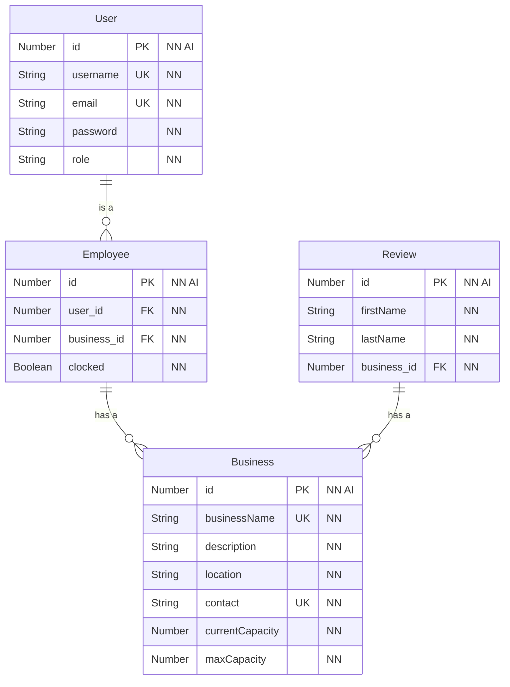

# Inital Mongoose Schema

## ER Diagram

> NOTE: [Mermaid](https://mermaid-js.github.io/) is a diagramming charting tool that Github markdown and VS Code recognizes.
> In VS Code, you will need a couple of plugins.
>
> - [Markdown Preview Mermaid Support](https://marketplace.visualstudio.com/items?itemName=bierner.markdown-mermaid)
> - [Marp for VS Code](https://marketplace.visualstudio.com/items?itemName=marp-team.marp-vscode)
>
> Use these plugins to enable markdown preview with Mermaid support.

> Note: IDs are added to schema items since technically they are tables in our database.

> NOTE: @jrcharney, here. My mind is still thinking in terms of MySQL, but these abbreviations should still be useful for MongoDB, Mongoose, and GraphQL. Just add a column to the following table to show the equivalent meaning.

| Abbr. | Meaning               |
| ----- | --------------------- |
| `PK`  | `PRIMARY KEY`         |
| `FK`  | `FOREIGN KEY`         |
| `UK`  | `UNIQUE` (Key)        |
| `NN`  | `NOT NULL` (Required) |
| `AI`  | `AUTO_INCREMENT`      |

