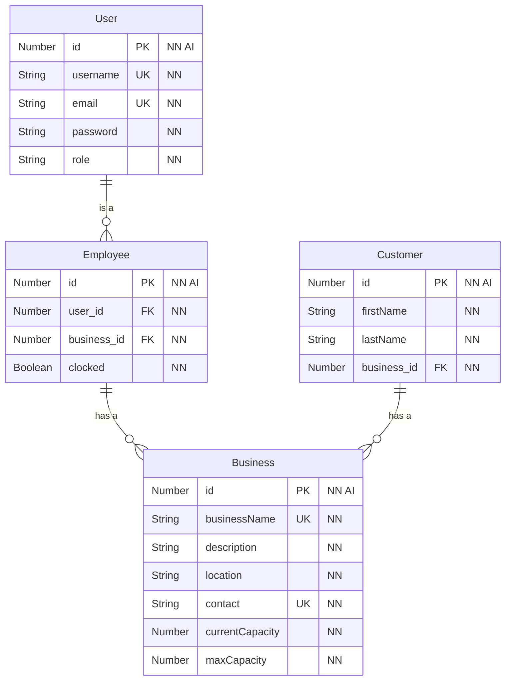

# Inital Mongoose Schema

## ER Diagram

> NOTE: [Mermaid](https://mermaid-js.github.io/) is a diagramming charting tool that Github markdown and VS Code recognizes.
> In VS Code, you will need a couple of plugins.
> 
> - [Markdown Preview Mermaid Support](https://marketplace.visualstudio.com/items?itemName=bierner.markdown-mermaid)
> - [Marp for VS Code](https://marketplace.visualstudio.com/items?itemName=marp-team.marp-vscode)
>
> Use these plugins to enable markdown preview with Mermaid support.

> Note: IDs are added to schema items since technically they are tables in our database.

> NOTE: @jrcharney, here. My mind is still thinking in terms of MySQL, but these abbreviations should still be useful for MongoDB, Mongoose, and GraphQL. Just add a column to the following table to show the equivalent meaning.

| Abbr. | Meaning               |
|-------|-----------------------|
| `PK`  | `PRIMARY KEY`         |
| `FK`  | `FOREIGN KEY`         |
| `UK`  | `UNIQUE` (Key)        |
| `NN`  | `NOT NULL` (Required) |
| `AI`  | `AUTO_INCREMENT`      |



## Database Models and Schemas

> NOTE: Models are written as ECMAScript modules.

### User Schema

```javascript
import { Schema, model } from 'mongoose';
import bcrypt from 'bcrypt';

const userSchema = new Schema(
  {
    username: {
      type:     String,
      required: true,
      unique:   true,
    },
    email: {
      type:     String,
      required: true,
      unique:   true,
      match:    [/.+@.+\..+/, 'Must use a valid email address'],
    },
    password: {
      type:     String,
      required: true,
    },
    role:{
      type:     String,
      required: true,
      unique:   false,
    }
  },
  // set this to use virtual below
  {
    toJSON: {
      virtuals: true,
    },
  }
);

// has a user password
userSchema.pre('save', async function(next) {
  if(this.isNew || this.isModified('password')){
    const saltRounds = 10;                        // TODO: Replace this with a variable in a .env file
    this.password - await bcrypt.hash(this.password, saltRounds);
  }
  next();
});

// custom method to compare and validate password for loggining in
userSchema.methods.isCorrectPassword = async function (password){
  return bcrypt.compare(password, this.password);
}

const User = model('User',userSchema);

export { userSchema, User };
```

### Business Schema

> TODO: `Customer` should be changed to `Review` since this isn't a customer, it is a customer review.

```javascript
import { Schema, model } from 'mongoose';
import employeeSchema from './Employee';
import customerSchema from './Customer';

const BusinessSchema = new Schema(
  {
    businessName: {
      type:     String,
      required: true,
      unique:   true,
    },
    description: {
      type:     String,
      required: true,
      unique:   false,
    },
    location: {
      type:     String,
      required: true,
    },
    contact:{
      type:     String,
      required: true,
      unique:   true
    },
    currentCapacity: {
      type:     Number,
      required: true,
    },
    maxCapacity:{
        type:    Number,
        required:true,
    },
    employees:[employeeSchema],
    customers:[customerSchema]
  },
  // set this to use virtual below
  {
    toJSON: {
      virtuals: true,
    },
  }
);

const Business = model('User',userSchema);

export { businessSchema, Business };
```

### Employee Schema

```javascript
import { Schema, model } from 'mongoose';
import userSchema from './users';

const employeeSchema = new Schema(
  {
    users: [userSchema],
    clocked:{
        type:     Boolean,
        required: true
    }
  },
  // set this to use virtual below
  {
    toJSON: {
      virtuals: true,
    },
  }
);

const Employee = model('Employee',employeeSchema);

export { employeeSchema, Employee };
```

### Customer Schema

> TODO: This should be changed to `Review` since this isn't a customer, it is a customer review.

```javascript
import { Schema, model } from 'mongoose';

const customerSchema = new Schema(
  {
    firstName: {
      type:     String,
      required: true,
      unique:   false,
    },
    lastName: {
      type:     String,
      required: true,
      unique:   false,
    },
    rating: {
      type:     String,
      required: true,
      unique:   false,
    },
    comment: {
      type:     String,
      required: true,
      unique:   false,
    },
  },
  // set this to use virtual below
  {
    toJSON: {
      virtuals:  true,
    },
    timestamps: {         // TODO: Double check this
      createdAt: true,
      updatedAt: false
    }
  }
);

const Customer = model('Customer',customerSchema);

export {customerSchema, Customer}
```
